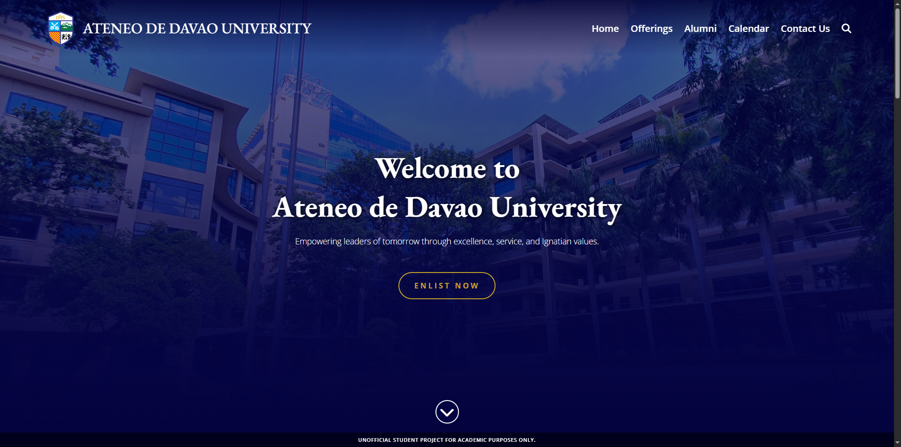
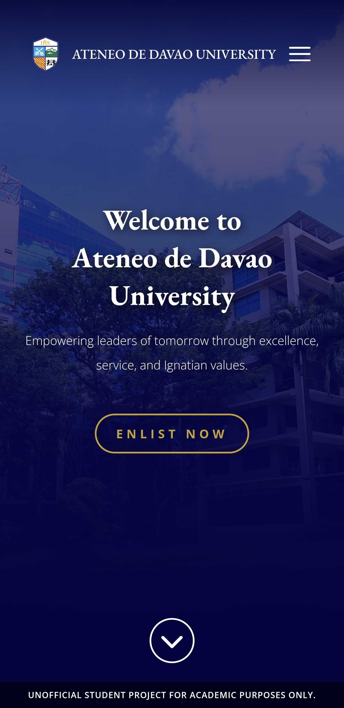
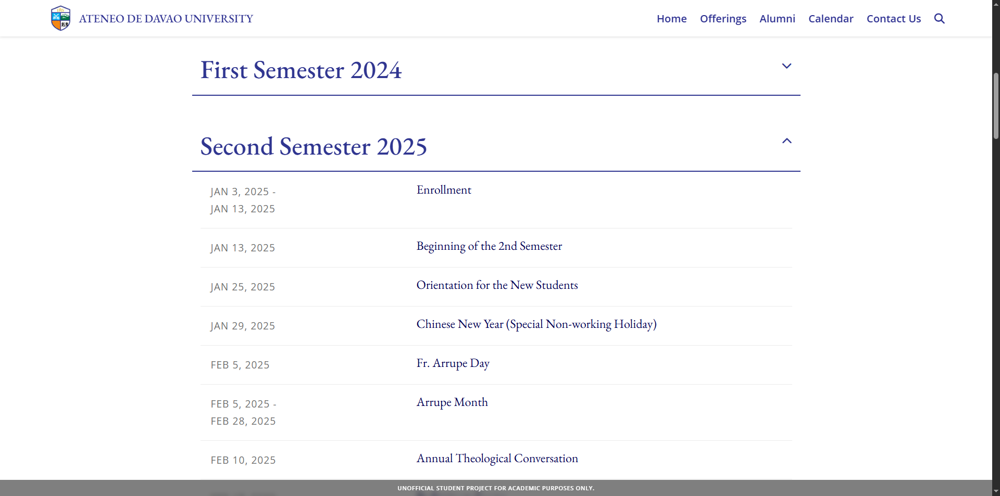
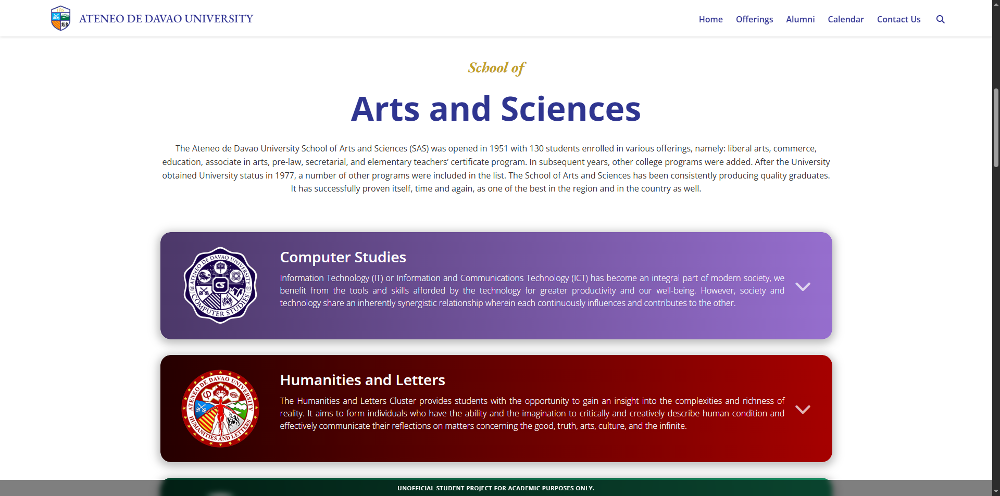
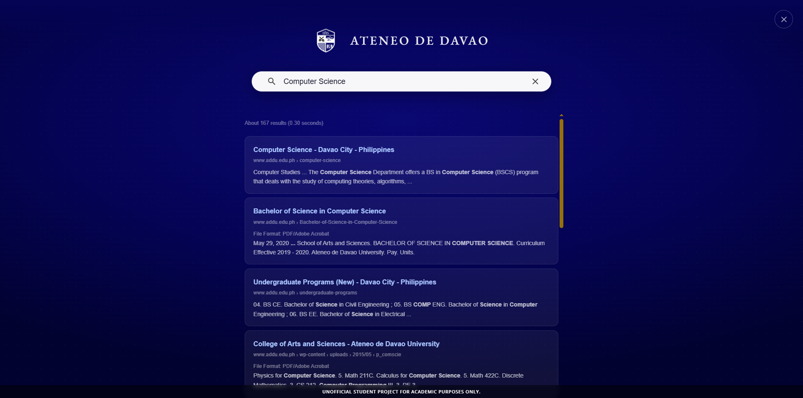

# EDP Final Project - AdDU Website Rebrand (Unofficial)



## Overview
This repository contains our final project for the Event Driven Programming course.
The task was to rebrand an existing website, and our assigned target was the school website of Ateneo de Davao University.

This project is a static multi-page site that demonstrates event-driven UI behavior (navigation interactions, overlays, accordions, and dynamic content rendering from JSON).

## Course Context
- Course: Event Driven Programming
- Project Type: Website rebrand
- Academic Term: Final project
- Team: Roque and Serra

## Important Disclaimer
This is a student project made for academic purposes only.
It is **not** an official Ateneo de Davao University website, product, or publication.
All branding and institutional references are used only in the context of the classroom requirement.

## Key Features
- Multi-page website rebrand (`index`, `program-offerings`, `alumni`, `calendar`, `contact`)
- Shared header and footer styling across pages
- Hero sections and page-specific visual themes
- Search overlay UI
- Scroll-to-top button and scroll-based interactions
- Dynamic calendar/event rendering from `calendar-data.json`
- Program offerings rendering from `data.json`

## Tech Stack
- HTML5
- CSS3
- Vanilla JavaScript (event-driven DOM interactions)
- Local vendor assets (Bootstrap files included in `vendor/boostrap/`)
- External libraries/services:
	- Font Awesome
	- Google Custom Search Engine

## Project Structure
```
EDP-Final-Project/
|- index.html
|- program-offerings.html
|- alumni.html
|- calendar.html
|- contact.html
|- data.json
|- calendar-data.json
|- css/
|- js/
|- assets/
|- img/
|- vendor/
```

## Getting Started
1. Clone or download this repository.
2. Open the project folder in VS Code.
3. Launch `index.html` using a local static server (recommended) or open it directly in a browser.

### Recommended Local Run (VS Code)
- Install the Live Server extension.
- Right-click `index.html` and choose **Open with Live Server**.

## Pages
- Home: `index.html`
- Program Offerings: `program-offerings.html`
- Alumni: `alumni.html`
- Academic Calendar: `calendar.html`
- Contact: `contact.html`

## Screenshots and Media

### Desktop vs Mobile Responsiveness
We ensured the application scales beautifully across all devices, converting complex grid layouts into readable mobile stacks.
<p align="center">
  
  &nbsp; &nbsp;
  
</p>

### Dynamic JSON Rendering
Content for the Academic Calendar and Program Offerings is dynamically generated from JSON files using Vanilla JavaScript.
<p align="center">
  
</p>
<p align="center">
  
</p>

### Event-Driven UI (Search Overlay)
Custom search overlay triggered via DOM events, completely overriding Google Custom Search Engine's default injected styling.
<p align="center">
  
</p>

## Room for Improvements
- Handle empty state for upcoming events in index.html
- Improve website accessibility (adding proper ARIA labels and better keyboard navigation)
- Add stronger null checks in our shared JS files so missing DOM elements on certain pages don't throw console errors

## License
This project is distributed under the license included in `LICENSE`.